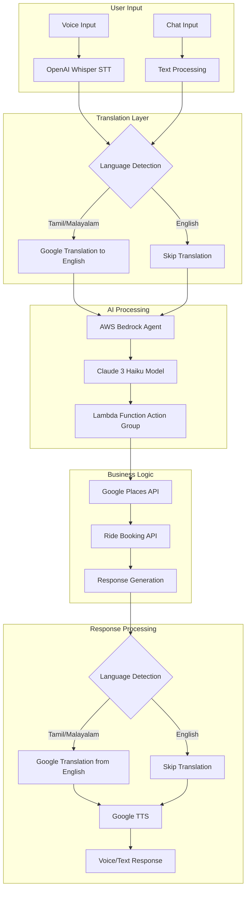

# AI-Powered Ride Booking System
## Architecture & Implementation Guide

---

## Table of Contents
1. [System Overview](#system-overview)
2. [Architecture Diagram](#architecture-diagram)
3. [Technology Stack](#technology-stack)
4. [Voice Scenario Implementation](#voice-scenario-implementation)
5. [Chat Scenario Implementation](#chat-scenario-implementation)
6. [Core Components](#core-components)
7. [API Integrations](#api-integrations)
8. [Lambda Function Implementation](#lambda-function-implementation)
9. [Dialog Management](#dialog-management)
10. [Complete Python Implementation](#complete-python-implementation)
11. [Deployment Guide](#deployment-guide)
12. [Environment Variables](#environment-variables)

---

## System Overview

This system provides a multilingual (English, Tamil, Malayalam) ride booking service through both voice and chat interfaces. It leverages AI models for natural language processing, speech recognition, and intelligent conversation management.

### Key Features
- **Multilingual Support**: English, Tamil, Malayalam
- **Dual Interface**: Voice calls/messages and text chat
- **Intelligent Routing**: AWS Bedrock Agent with Claude 3 Haiku
- **Real-time Translation**: Google Cloud Translation API
- **Location Services**: Google Places Autocomplete API
- **Voice Processing**: OpenAI Whisper (STT) and Google TTS

---

## Architecture Diagram



---

## Technology Stack

| Component | Technology | Purpose |
|-----------|------------|---------|
| **Speech-to-Text** | OpenAI Whisper | Voice recognition for multiple languages |
| **Text-to-Speech** | Google Cloud TTS | Natural voice synthesis |
| **Translation** | Google Cloud Translation | Tamil/Malayalam ↔ English |
| **LLM** | Claude 3 Haiku (AWS Bedrock) | Conversation intelligence |
| **Dialog Manager** | Rasa Framework | Conversation flow control |
| **Location Service** | Google Places Autocomplete | Address resolution |
| **Serverless Compute** | AWS Lambda | Business logic execution |
| **API Framework** | FastAPI | REST API endpoints |

---

## Voice Scenario Implementation

### Flow Sequence
1. **Voice Input** → OpenAI Whisper (STT)
2. **Language Detection** → If Tamil/Malayalam → Google Translation
3. **AI Processing** → AWS Bedrock Agent (Claude 3 Haiku)
4. **Action Execution** → Lambda Function
5. **Response Generation** → Translation (if needed)
6. **Voice Output** → Google TTS

### Python Implementation - Voice Handler

```python
import openai
import boto3
from google.cloud import translate_v2 as translate
from google.cloud import texttospeech
import json
import requests
from typing import Dict, Optional, Tuple

class VoiceHandler:
    def __init__(self):
        self.whisper_client = openai.OpenAI()
        self.translate_client = translate.Client()
        self.tts_client = texttospeech.TextToSpeechClient()
        self.bedrock_client = boto3.client('bedrock-agent-runtime')
        
    async def process_voice_input(self, audio_file_path: str) -> Dict:
        """Process voice input through the complete pipeline"""
        
        # Step 1: Speech to Text
        transcript = await self.speech_to_text(audio_file_path)
        
        # Step 2: Detect language and translate if needed
        detected_lang = self.detect_language(transcript)
        english_text = transcript
        
        if detected_lang in ['ta', 'ml']:  # Tamil or Malayalam
            english_text = self.translate_to_english(transcript, detected_lang)
        
        # Step 3: Process with AWS Bedrock Agent
        agent_response = await self.process_with_bedrock(english_text)
        
        # Step 4: Translate response back if needed
        final_response = agent_response['text']
        if detected_lang in ['ta', 'ml']:
            final_response = self.translate_from_english(
                agent_response['text'], 
                detected_lang
            )
        
        # Step 5: Convert to speech
        audio_response = await self.text_to_speech(final_response, detected_lang)
        
        return {
            'original_text': transcript,
            'detected_language': detected_lang,
            'response_text': final_response,
            'audio_response': audio_response,
            'ride_details': agent_response.get('ride_details')
        }
    
    async def speech_to_text(self, audio_file_path: str) -> str:
        """Convert speech to text using OpenAI Whisper"""
        with open(audio_file_path, "rb") as audio_file:
            transcript = self.whisper_client.audio.transcriptions.create(
                model="whisper-1",
                file=audio_file,
                language=None  # Auto-detect language
            )
        return transcript.text
    
    def detect_language(self, text: str) -> str:
        """Detect language of the text"""
        result = self.translate_client.detect_language(text)
        return result['language']
    
    def translate_to_english(self, text: str, source_lang: str) -> str:
        """Translate Tamil/Malayalam to English"""
        result = self.translate_client.translate(
            text,
            source_language=source_lang,
            target_language='en'
        )
        return result['translatedText']
    
    def translate_from_english(self, text: str, target_lang: str) -> str:
        """Translate English to Tamil/Malayalam"""
        result = self.translate_client.translate(
            text,
            source_language='en',
            target_language=target_lang
        )
        return result['translatedText']
    
    async def text_to_speech(self, text: str, language_code: str) -> bytes:
        """Convert text to speech using Google TTS"""
        language_map = {
            'en': 'en-US',
            'ta': 'ta-IN',
            'ml': 'ml-IN'
        }
        
        synthesis_input = texttospeech.SynthesisInput(text=text)
        voice = texttospeech.VoiceSelectionParams(
            language_code=language_map.get(language_code, 'en-US'),
            ssml_gender=texttospeech.SsmlVoiceGender.NEUTRAL
        )
        audio_config = texttospeech.AudioConfig(
            audio_encoding=texttospeech.AudioEncoding.MP3
        )
        
        response = self.tts_client.synthesize_speech(
            input=synthesis_input,
            voice=voice,
            audio_config=audio_config
        )
        
        return response.audio_content
```

---

## Chat Scenario Implementation

### Flow Sequence
1. **Text Input** → Language Detection
2. **Translation** → If Tamil/Malayalam → Google Translation
3. **AI Processing** → AWS Bedrock Agent
4. **Action Execution** → Lambda Function
5. **Response Generation** → Translation (if needed)
6. **Text Output** → Send response

### Python Implementation - Chat Handler

```python
class ChatHandler:
    def __init__(self):
        self.translate_client = translate.Client()
        self.bedrock_client = boto3.client('bedrock-agent-runtime')
        self.session_manager = SessionManager()
        
    async def process_chat_message(self, message: str, session_id: str) -> Dict:
        """Process chat message through the pipeline"""
        
        # Step 1: Detect language and translate if needed
        detected_lang = self.detect_language(message)
        english_text = message
        
        if detected_lang in ['ta', 'ml']:
            english_text = self.translate_to_english(message, detected_lang)
        
        # Step 2: Get session context
        session_context = self.session_manager.get_context(session_id)
        
        # Step 3: Process with AWS Bedrock Agent
        agent_response = await self.process_with_bedrock(
            english_text, 
            session_context
        )
        
        # Step 4: Update session context
        self.session_manager.update_context(
            session_id, 
            agent_response['context']
        )
        
        # Step 5: Translate response back if needed
        final_response = agent_response['text']
        if detected_lang in ['ta', 'ml']:
            final_response = self.translate_from_english(
                agent_response['text'], 
                detected_lang
            )
        
        return {
            'original_message': message,
            'detected_language': detected_lang,
            'response': final_response,
            'ride_details': agent_response.get('ride_details'),
            'next_step': agent_response.get('next_step')
        }
    
    async def process_with_bedrock(
        self, 
        text: str, 
        context: Dict
    ) -> Dict:
        """Process text with AWS Bedrock Agent"""
        
        response = self.bedrock_client.invoke_agent(
            agentId='YOUR_AGENT_ID',
            agentAliasId='YOUR_ALIAS_ID',
            sessionId=context.get('session_id'),
            inputText=text,
            sessionState={
                'sessionAttributes': context
            }
        )
        
        return self.parse_bedrock_response(response)
```

---

## Core Components

### 1. AWS Bedrock Agent Configuration

```python
class BedrockAgentManager:
    def __init__(self):
        self.bedrock_client = boto3.client('bedrock-agent')
        self.runtime_client = boto3.client('bedrock-agent-runtime')
        
    def create_agent(self):
        """Create and configure Bedrock Agent"""
        agent_config = {
            'agentName': 'RideBookingAgent',
            'foundationModel': 'anthropic.claude-3-haiku-20240307-v1:0',
            'instruction': """
            You are a ride booking assistant. Help users book auto rides by:
            1. Collecting pickup location
            2. Collecting drop location
            3. Collecting phone number
            4. Confirming and creating the ride
            
            Maintain context and guide users through each step.
            """,
            'idleSessionTTLInSeconds': 600,
            'agentResourceRoleArn': 'YOUR_IAM_ROLE_ARN'
        }
        
        response = self.bedrock_client.create_agent(**agent_config)
        return response['agent']
    
    def attach_action_group(self, agent_id: str, lambda_arn: str):
        """Attach Lambda function as action group"""
        action_group = {
            'actionGroupName': 'RideBookingActions',
            'agentId': agent_id,
            'actionGroupExecutor': {
                'lambda': lambda_arn
            },
            'apiSchema': {
                's3': {
                    's3BucketName': 'YOUR_BUCKET',
                    's3ObjectKey': 'api-schema.yaml'
                }
            }
        }
        
        response = self.bedrock_client.create_agent_action_group(**action_group)
        return response
```

### 2. Session Manager

```python
from typing import Dict, Optional
import redis
import json
from datetime import datetime, timedelta

class SessionManager:
    def __init__(self):
        self.redis_client = redis.Redis(
            host='localhost',
            port=6379,
            decode_responses=True
        )
        self.session_ttl = 3600  # 1 hour
        
    def create_session(self, user_id: str) -> str:
        """Create new session for user"""
        session_id = f"session_{user_id}_{datetime.now().timestamp()}"
        initial_context = {
            'user_id': user_id,
            'state': 'greeting',
            'pickup_location': None,
            'drop_location': None,
            'phone_number': None,
            'created_at': datetime.now().isoformat()
        }
        
        self.redis_client.setex(
            session_id,
            self.session_ttl,
            json.dumps(initial_context)
        )
        
        return session_id
    
    def get_context(self, session_id: str) -> Optional[Dict]:
        """Get session context"""
        context = self.redis_client.get(session_id)
        return json.loads(context) if context else None
    
    def update_context(self, session_id: str, updates: Dict):
        """Update session context"""
        current = self.get_context(session_id)
        if current:
            current.update(updates)
            self.redis_client.setex(
                session_id,
                self.session_ttl,
                json.dumps(current)
            )
```

---

## API Integrations

### 1. Google Places Autocomplete Integration

```python
import googlemaps
from typing import Dict, List

class GooglePlacesService:
    def __init__(self, api_key: str):
        self.gmaps = googlemaps.Client(key=api_key)
        
    def autocomplete_location(self, input_text: str) -> List[Dict]:
        """Get location suggestions"""
        predictions = self.gmaps.places_autocomplete(
            input_text=input_text,
            components={'country': 'IN'},  # Restrict to India
            types=['establishment', 'geocode']
        )
        
        return predictions
    
    def get_place_details(self, place_id: str) -> Dict:
        """Get detailed information about a place"""
        place = self.gmaps.place(place_id=place_id)
        
        return {
            'formatted_address': place['result']['formatted_address'],
            'lat': place['result']['geometry']['location']['lat'],
            'lng': place['result']['geometry']['location']['lng'],
            'name': place['result'].get('name', '')
        }
    
    def resolve_location(self, location_text: str) -> Dict:
        """Resolve location text to coordinates"""
        # First, try autocomplete
        predictions = self.autocomplete_location(location_text)
        
        if predictions:
            # Get details of the first prediction
            place_id = predictions[0]['place_id']
            details = self.get_place_details(place_id)
            
            return {
                'location': details['formatted_address'],
                'coordinates': {
                    'lat': details['lat'],
                    'lng': details['lng']
                }
            }
        
        # Fallback to geocoding
        geocode_result = self.gmaps.geocode(location_text)
        if geocode_result:
            return {
                'location': geocode_result[0]['formatted_address'],
                'coordinates': {
                    'lat': geocode_result[0]['geometry']['location']['lat'],
                    'lng': geocode_result[0]['geometry']['location']['lng']
                }
            }
        
        return None
```

### 2. Ride Booking API Integration

```python
import requests
from typing import Dict, Optional

class RideBookingAPI:
    def __init__(self, base_url: str):
        self.base_url = base_url
        self.create_ride_endpoint = f"{base_url}/map/admin/create-admin-ride"
        
    def create_ride(
        self,
        phone_number: str,
        pickup_location: Dict,
        drop_location: Dict,
        phone_code: str = "+91"
    ) -> Dict:
        """Create a new ride booking"""
        
        payload = {
            "phone_code": phone_code,
            "phone_number": phone_number,
            "origin_latitude": pickup_location['lat'],
            "origin_longitude": pickup_location['lng'],
            "destination_latitude": drop_location['lat'],
            "destination_longitude": drop_location['lng'],
            "pickup_location": pickup_location['address'],
            "drop_location": drop_location['address'],
            "distance": "N/A",
            "duration": "N/A"
        }
        
        try:
            response = requests.post(
                self.create_ride_endpoint,
                json=payload,
                timeout=10
            )
            response.raise_for_status()
            
            return {
                'success': True,
                'data': response.json()
            }
            
        except requests.exceptions.RequestException as e:
            return {
                'success': False,
                'error': str(e)
            }
    
    def cancel_ride(self, ride_id: int) -> Dict:
        """Cancel an existing ride"""
        cancel_endpoint = f"{self.base_url}/map/admin/cancel-ride/{ride_id}"
        
        try:
            response = requests.post(cancel_endpoint, timeout=10)
            response.raise_for_status()
            
            return {
                'success': True,
                'message': 'Ride cancelled successfully'
            }
            
        except requests.exceptions.RequestException as e:
            return {
                'success': False,
                'error': str(e)
            }
```

---

## Lambda Function Implementation

```python
import json
import os
from typing import Dict
import boto3

# Initialize services
places_service = GooglePlacesService(os.environ['GOOGLE_MAPS_API_KEY'])
ride_api = RideBookingAPI(os.environ['RIDE_API_BASE_URL'])

def lambda_handler(event, context):
    """
    AWS Lambda function for handling ride booking actions
    """
    
    # Extract action and parameters
    action = event.get('action')
    parameters = event.get('parameters', {})
    session_attributes = event.get('sessionAttributes', {})
    
    try:
        if action == 'resolve_location':
            return handle_location_resolution(parameters)
            
        elif action == 'create_ride':
            return handle_ride_creation(parameters, session_attributes)
            
        elif action == 'get_ride_status':
            return handle_ride_status(parameters)
            
        elif action == 'cancel_ride':
            return handle_ride_cancellation(parameters)
            
        else:
            return {
                'statusCode': 400,
                'body': json.dumps({
                    'error': f'Unknown action: {action}'
                })
            }
            
    except Exception as e:
        return {
            'statusCode': 500,
            'body': json.dumps({
                'error': str(e)
            })
        }

def handle_location_resolution(params: Dict) -> Dict:
    """Resolve location text to coordinates"""
    location_text = params.get('location_text')
    location_type = params.get('type')  # 'pickup' or 'drop'
    
    if not location_text:
        return {
            'statusCode': 400,
            'body': json.dumps({
                'error': 'Location text is required'
            })
        }
    
    # Resolve location using Google Places
    location_data = places_service.resolve_location(location_text)
    
    if not location_data:
        return {
            'statusCode': 404,
            'body': json.dumps({
                'error': 'Could not resolve location'
            })
        }
    
    return {
        'statusCode': 200,
        'body': json.dumps({
            'type': location_type,
            'location': location_data['location'],
            'coordinates': location_data['coordinates']
        })
    }

def handle_ride_creation(params: Dict, session: Dict) -> Dict:
    """Create a new ride booking"""
    
    # Extract required parameters
    phone_number = params.get('phone_number')
    pickup_data = session.get('pickup_location')
    drop_data = session.get('drop_location')
    
    # Validate all required data
    if not all([phone_number, pickup_data, drop_data]):
        missing = []
        if not phone_number:
            missing.append('phone number')
        if not pickup_data:
            missing.append('pickup location')
        if not drop_data:
            missing.append('drop location')
            
        return {
            'statusCode': 400,
            'body': json.dumps({
                'error': f'Missing required information: {", ".join(missing)}'
            })
        }
    
    # Create ride via API
    result = ride_api.create_ride(
        phone_number=phone_number,
        pickup_location={
            'lat': pickup_data['coordinates']['lat'],
            'lng': pickup_data['coordinates']['lng'],
            'address': pickup_data['location']
        },
        drop_location={
            'lat': drop_data['coordinates']['lat'],
            'lng': drop_data['coordinates']['lng'],
            'address': drop_data['location']
        }
    )
    
    if result['success']:
        return {
            'statusCode': 200,
            'body': json.dumps({
                'success': True,
                'ride_id': result['data']['ride_id'],
                'message': result['data']['message'],
                'details': {
                    'pickup': pickup_data['location'],
                    'drop': drop_data['location'],
                    'phone': phone_number
                }
            })
        }
    else:
        return {
            'statusCode': 500,
            'body': json.dumps({
                'error': 'Failed to create ride',
                'details': result['error']
            })
        }

def handle_ride_status(params: Dict) -> Dict:
    """Get ride status"""
    ride_id = params.get('ride_id')
    
    if not ride_id:
        return {
            'statusCode': 400,
            'body': json.dumps({
                'error': 'Ride ID is required'
            })
        }
    
    # Mock response - implement actual status check
    return {
        'statusCode': 200,
        'body': json.dumps({
            'ride_id': ride_id,
            'status': 'driver_assigned',
            'driver': {
                'name': 'Raja',
                'phone': '3698521470',
                'vehicle_number': 'TN 01 AB 1234'
            },
            'eta': '5 minutes'
        })
    }

def handle_ride_cancellation(params: Dict) -> Dict:
    """Cancel a ride"""
    ride_id = params.get('ride_id')
    
    if not ride_id:
        return {
            'statusCode': 400,
            'body': json.dumps({
                'error': 'Ride ID is required'
            })
        }
    
    result = ride_api.cancel_ride(ride_id)
    
    if result['success']:
        return {
            'statusCode': 200,
            'body': json.dumps({
                'success': True,
                'message': 'Your ride has been cancelled'
            })
        }
    else:
        return {
            'statusCode': 500,
            'body': json.dumps({
                'error': 'Failed to cancel ride',
                'details': result['error']
            })
        }
```

---

## Dialog Management

### Rasa Configuration

```yaml
# domain.yml
version: "3.1"

intents:
  - greet
  - provide_pickup_location
  - provide_drop_location
  - provide_phone_number
  - confirm_ride
  - cancel_ride
  - request_status
  - change_location

entities:
  - location
  - phone_number

slots:
  pickup_location:
    type: text
    influence_conversation: true
    mappings:
      - type: from_entity
        entity: location
        intent: provide_pickup_location
  
  drop_location:
    type: text
    influence_conversation: true
    mappings:
      - type: from_entity
        entity: location
        intent: provide_drop_location
  
  phone_number:
    type: text
    influence_conversation: true
    mappings:
      - type: from_entity
        entity: phone_number
        intent: provide_phone_number
  
  ride_id:
    type: text
    influence_conversation: false

responses:
  utter_greet:
    - text: "Hello! I help with auto ride booking. What is your pickup location?"
  
  utter_ask_drop_location:
    - text: "What is your drop location?"
  
  utter_ask_phone_number:
    - text: "Please provide your phone number. The driver will contact you soon."
  
  utter_confirm_ride:
    - text: "Ride request sent. Driver will call in 5 minutes."
  
  utter_ride_cancelled:
    - text: "Your ride has been cancelled."
  
  utter_driver_details:
    - text: "Driver Name: {driver_name}, Phone: {driver_phone}"

actions:
  - action_resolve_location
  - action_create_ride
  - action_get_ride_status
  - action_cancel_ride
```

### Custom Actions

```python
# actions.py
from typing import Dict, Text, Any, List
from rasa_sdk import Action, Tracker
from rasa_sdk.executor import CollectingDispatcher
from rasa_sdk.events import SlotSet

class ActionResolveLocation(Action):
    def name(self) -> Text:
        return "action_resolve_location"
    
    def run(
        self,
        dispatcher: CollectingDispatcher,
        tracker: Tracker,
        domain: Dict[Text, Any]
    ) -> List[Dict[Text, Any]]:
        
        location_text = tracker.latest_message.get('text')
        intent = tracker.latest_message['intent']['name']
        
        # Resolve location using Google Places
        location_data = places_service.resolve_location(location_text)
        
        if location_data:
            if 'pickup' in intent:
                return [SlotSet("pickup_location", location_data)]
            elif 'drop' in intent:
                return [SlotSet("drop_location", location_data)]
        
        dispatcher.utter_message(
            text="I couldn't find that location. Please try again."
        )
        return []

class ActionCreateRide(Action):
    def name(self) -> Text:
        return "action_create_ride"
    
    def run(
        self,
        dispatcher: CollectingDispatcher,
        tracker: Tracker,
        domain: Dict[Text, Any]
    ) -> List[Dict[Text, Any]]:
        
        pickup = tracker.get_slot('pickup_location')
        drop = tracker.get_slot('drop_location')
        phone = tracker.get_slot('phone_number')
        
        if all([pickup, drop, phone]):
            # Create ride using API
            result = ride_api.create_ride(
                phone_number=phone,
                pickup_location=pickup,
                drop_location=drop
            )
            
            if result['success']:
                dispatcher.utter_message(
                    text=f"Ride request sent! Ride ID: {result['data']['ride_id']}. "
                    f"Driver will call in 5 minutes."
                )
                return [SlotSet("ride_id", result['data']['ride_id'])]
            else:
                dispatcher.utter_message(
                    text="Failed to create ride. Please try again."
                )
        else:
            missing = []
            if not pickup:
                missing.append("pickup location")
            if not drop:
                missing.append("drop location")
            if not phone:
                missing.append("phone number")
            
            dispatcher.utter_message(
                text=f"Please provide: {', '.join(missing)}"
            )
        
        return []
```

---

## Complete Python Implementation

### Main Application

```python
# main.py
from fastapi import FastAPI, HTTPException, BackgroundTasks
from fastapi.middleware.cors import CORSMiddleware
from pydantic import BaseModel
from typing import Optional, Dict
import uvicorn
import os

# Initialize FastAPI app
app = FastAPI(title="AI Ride Booking System")

# Add CORS middleware
app.add_middleware(
    CORSMiddleware,
    allow_origins=["*"],
    allow_credentials=True,
    allow_methods=["*"],
    allow_headers=["*"],
)

# Initialize handlers
voice_handler = VoiceHandler()
chat_handler = ChatHandler()
session_manager = SessionManager()

# Request/Response Models
class ChatRequest(BaseModel):
    message: str
    session_id: Optional[str] = None
    language: Optional[str] = "en"

class ChatResponse(BaseModel):
    response: str
    session_id: str
    ride_details: Optional[Dict] = None
    next_action: Optional[str] = None

class VoiceRequest(BaseModel):
    audio_data: bytes
    session_id: Optional[str] = None

class VoiceResponse(BaseModel):
    text_response: str
    audio_response: Optional[bytes] = None
    session_id: str
    ride_details: Optional[Dict] = None

# API Endpoints
@app.post("/api/chat", response_model=ChatResponse)
async def process_chat(request: ChatRequest):
    """Process chat message"""
    try:
        # Create session if not exists
        if not request.session_id:
            request.session_id = session_manager.create_session("user")
        
        # Process message
        result = await chat_handler.process_chat_message(
            request.message,
            request.session_id
        )
        
        return ChatResponse(
            response=result['response'],
            session_id=request.session_id,
            ride_details=result.get('ride_details'),
            next_action=result.get('next_step')
        )
        
    except Exception as e:
        raise HTTPException(status_code=500, detail=str(e))

@app.post("/api/voice", response_model=VoiceResponse)
async def process_voice(request: VoiceRequest):
    """Process voice input"""
    try:
        # Create session if not exists
        if not request.session_id:
            request.session_id = session_manager.create_session("user")
        
        # Save audio to temp file
        import tempfile
        with tempfile.NamedTemporaryFile(delete=False, suffix=".mp3") as tmp:
            tmp.write(request.audio_data)
            audio_path = tmp.name
        
        # Process voice
        result = await voice_handler.process_voice_input(audio_path)
        
        # Clean up temp file
        os.unlink(audio_path)
        
        return VoiceResponse(
            text_response=result['response_text'],
            audio_response=result.get('audio_response'),
            session_id=request.session_id,
            ride_details=result.get('ride_details')
        )
        
    except Exception as e:
        raise HTTPException(status_code=500, detail=str(e))

@app.get("/api/session/{session_id}")
async def get_session_status(session_id: str):
    """Get session status and context"""
    context = session_manager.get_context(session_id)
    
    if not context:
        raise HTTPException(status_code=404, detail="Session not found")
    
    return context

@app.post("/api/ride/{ride_id}/cancel")
async def cancel_ride(ride_id: int):
    """Cancel a ride"""
    try:
        ride_api = RideBookingAPI(os.environ['RIDE_API_BASE_URL'])
        result = ride_api.cancel_ride(ride_id)
        
        if result['success']:
            return {"message": "Ride cancelled successfully"}
        else:
            raise HTTPException(status_code=500, detail=result['error'])
            
    except Exception as e:
        raise HTTPException(status_code=500, detail=str(e))

@app.get("/api/ride/{ride_id}/status")
async def get_ride_status(ride_id: int):
    """Get ride status"""
    # Mock implementation - replace with actual API call
    return {
        "ride_id": ride_id,
        "status": "driver_assigned",
        "driver": {
            "name": "Raja",
            "phone": "3698521470",
            "vehicle_number": "TN 01 AB 1234"
        },
        "eta": "5 minutes"
    }

@app.get("/health")
async def health_check():
    """Health check endpoint"""
    return {"status": "healthy", "service": "AI Ride Booking System"}

if __name__ == "__main__":
    uvicorn.run(app, host="0.0.0.0", port=8000)